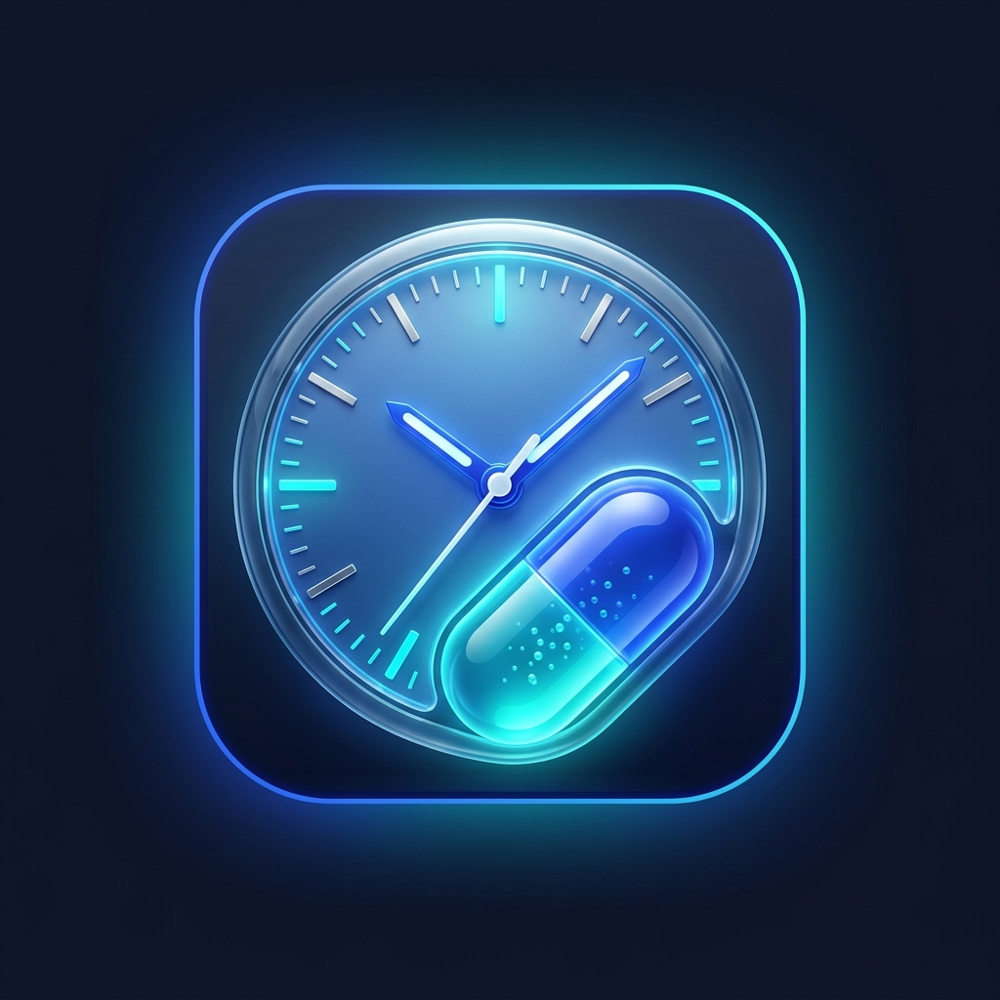
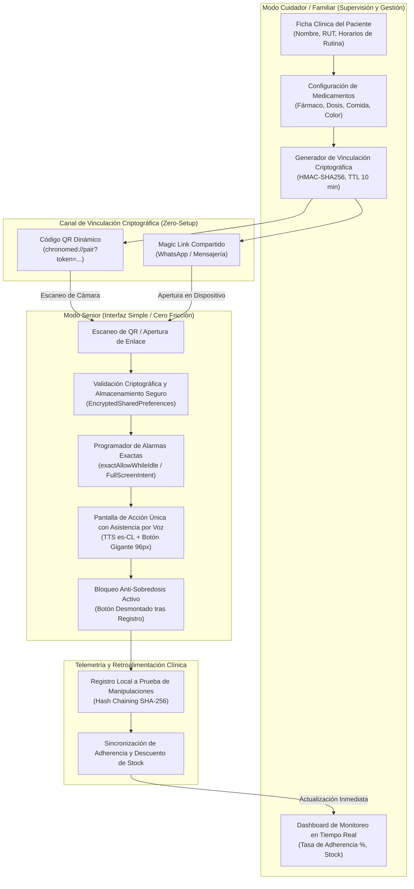
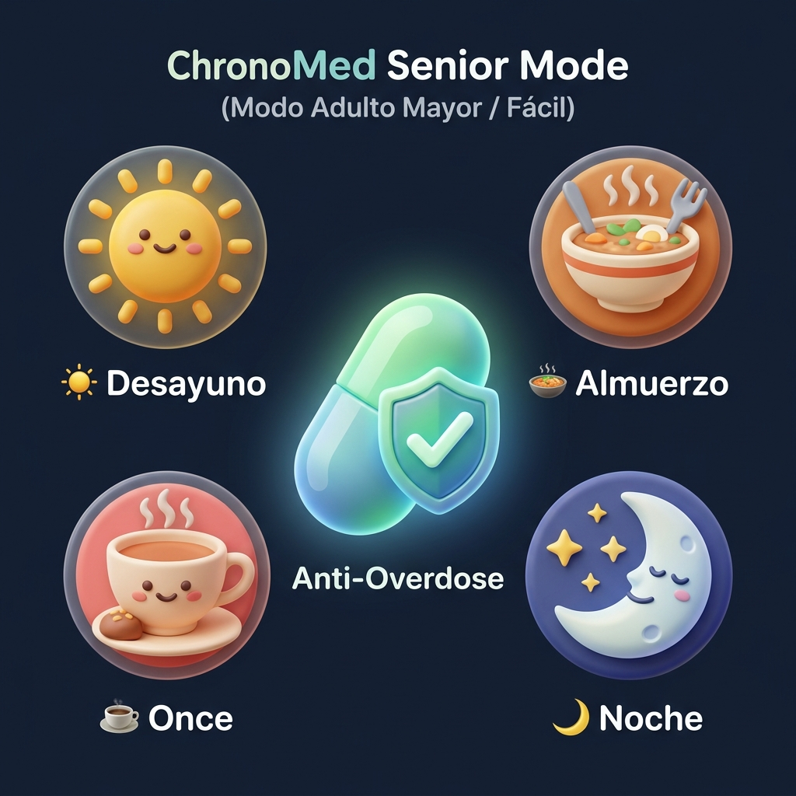
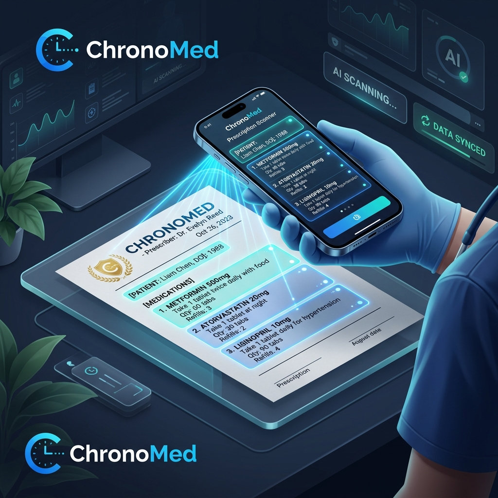
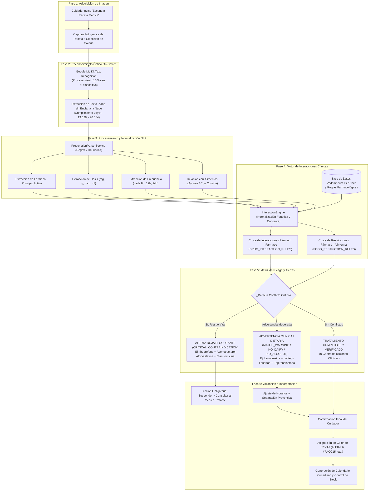
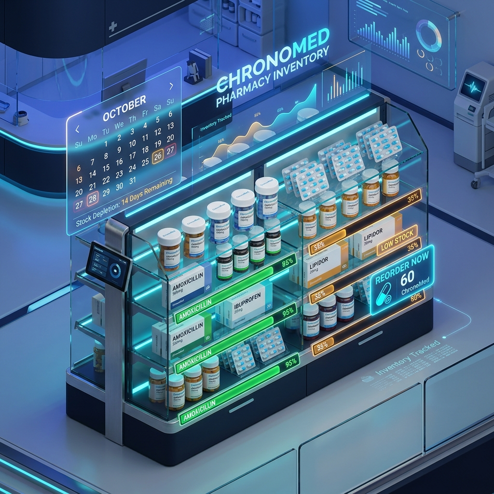

# Manual de Usuario Maestro — Plataforma ChronoMed


<div align="center">

# ChronoMed
### *Sincronización Inteligente de Medicación y Adherencia Clínica con Interfaz Dual*

**Versión:** 1.0.0 (Release para Producción)  
**Entorno Operativo:** Android Nativo (APK) & Web PWA (Offline-First)  
**Ámbito Territorial:** República de Chile (Marco Regulatorio ISP, Ley N° 20.584 y Ley N° 19.628)  
**Canal de Urgencia Vital:** SAMU 131 (`tel:131`)

---

</div>

## Índice General

1. [Portada & Identidad Visual ChronoMed](#1-portada--identidad-visual-chronomed)
2. [Marco Legal y Advertencias de Seguridad Clínica](#2-marco-legal-y-advertencias-de-seguridad-clínica)
3. [Arquitectura y Filosofía Dual (Modo Senior vs. Modo Cuidador)](#3-arquitectura-y-filosofía-dual-modo-senior-vs-modo-cuidador)
4. [Guía de Uso: Modo Senior (Simple / Cero Fricción)](#4-guía-de-uso-modo-senior-simple--cero-fricción)
   - *[4.5 Adaptabilidad de Franjas: Domicilio vs. Hospital / ELEAM](#45-adaptabilidad-de-franjas-y-regímenes-domicilio-vs-hospital--eleam)*
   - *[4.6 Accesibilidad Universal (a11y): WCAG AAA, Áreas Táctiles ≥ 48 dp y TalkBack](#46-accesibilidad-universal-a11y-wcag-aaa-áreas-táctiles--48-dp-y-anuncios-talkback-liveregion)*
5. [Mecanismo de Bloqueo Anti-Sobredosis y Reprogramación Dinámica](#5-mecanismo-de-bloqueo-anti-sobredosis-y-reprogramación-dinámica)
   - *[5.5 Protocolo de Escalada y Alerta de Dosis Omitida (45 min)](#55-protocolo-de-escalada-y-alerta-de-dosis-omitida-45-min)*
6. [Guía de Uso: Modo Cuidador / Estándar](#6-guía-de-uso-modo-cuidador--estándar)
   - *[6.3 Configuración de Horarios de las 4 Comidas (Hogar vs. Hospital / ELEAM)](#63-configuración-de-horarios-de-las-4-comidas-hogar-vs-hospital--eleam)*
7. [Escaneo OCR On-Device de Recetas Médicas y Alertas Farmacológicas](#7-escaneo-ocr-on-device-de-recetas-médicas-y-alertas-farmacológicas)
8. [Control Predictivo de Inventario de Farmacia y Fin de Semana](#8-control-predictivo-de-inventario-de-farmacia-y-fin-de-semana)
   - *[8.5 Escaneo OCR de Cajas de Medicamentos y Botiquín (ISP Chile)](#85-escaneo-ocr-de-cajas-de-medicamentos-y-botiquín-isp-chile)*
9. [Informes Clínicos Certificados y Cadena de Custodia Criptográfica](#9-informes-clínicos-certificados-y-cadena-de-custodia-criptográfica)
   - *[9.5 Exportación de Documentos PDF Oficiales y Envío Directo a WhatsApp](#95-exportación-de-documentos-pdf-oficiales-y-envío-directo-a-whatsapp)*
10. [Operación Fuera de Línea, Alarmas Exactas y Vinculación (QR / Magic Link)](#10-operación-fuera-de-línea-alarmas-exactas-y-vinculación-qr--magic-link)
11. [Guía de Instalación del APK Nativo Android y Optimización de Batería](#11-guía-de-instalación-del-apk-nativo-android-y-optimización-de-batería)
12. [Respaldo, Exportación y Migración de Ficha Clínica (Zero Data Loss)](#12-respaldo-exportación-y-migración-de-ficha-clínica-zero-data-loss)
   - *[12.4 Motor de Persistencia Local On-Device (Zero Data Loss)](#124-motor-de-persistencia-local-on-device-zero-data-loss)*
13. [Vademécum de Medicamentos de Uso Frecuente en Chile (Catálogo ISP)](#13-vademécum-de-medicamentos-de-uso-frecuente-en-chile-catálogo-isp)
14. [Preguntas Frecuentes y Resolución de Problemas (FAQ / Troubleshooting)](#14-preguntas-frecuentes-y-resolución-de-problemas-faq--troubleshooting)

---

## 1. Portada & Identidad Visual ChronoMed

<div align="center">
  
  <br/>
  <em>Isotipo Oficial: Sincronía entre Cronobiología y Farmacoterapia</em>
</div>

### 1.1 Misión y Filosofía de ChronoMed
**ChronoMed** nace con el propósito de erradicar los errores de dosificación, las intoxicaciones por duplicación accidental y el abandono terapéutico en pacientes crónicos y personas mayores en Chile. La plataforma implementa un paradigma revolucionario de **Interfaz Dual Complementaria**, que desacopla por completo la complejidad de gestión (asignada al cuidador o familiar) de la experiencia de toma del medicamento (diseñada bajo el principio de **cero fricción cognitiva** para el adulto mayor).

### 1.2 Simbología de la Identidad Visual
El isotipo oficial de ChronoMed encapsula la esencia científica y humana de la solución:
- **Fondo Azul Noche (`#0F172A` - Slate 900):** Representa el reposo circadiano, la sobriedad clínica y la máxima reducción de deslumbramiento en pantallas OLED.
- **Halo Neón Cian/Azul (`#00D2FF` / `#3B82F6`):** Simboliza la precisión tecnológica y la actividad constante de los algoritmos de supervisión en tiempo real.
- **Cronómetro Analógico con Manecillas Activas:** Refleja la cronofarmacología: administrar el fármaco en el instante biológico óptimo para maximizar la eficacia y minimizar los efectos adversos.
- **Cápsula Farmacológica Traslúcida con Microgránulos Efervescentes:** Expresa la farmacoterapia activa y la adherencia continua al tratamiento médico prescrito.

---

## 2. Marco Legal y Advertencias de Seguridad Clínica

ChronoMed ha sido desarrollado bajo estricta conformidad con el marco normativo sanitario y de protección de datos de la **República de Chile**. El uso de esta plataforma implica el conocimiento y aceptación de las siguientes advertencias legales y clínicas.

### 2.1 Declaración de Responsabilidad Clínica y No Sustitución Médica (Ley N° 20.584)

> ### ⚠️ DECLARACIÓN DE RESPONSABILIDAD CLÍNICA (Ley N° 20.584)
> *"ChronoMed es una plataforma de apoyo organizativo y registro asistencial del tratamiento farmacológico. ChronoMed no prescribe medicamentos, no efectúa diagnósticos clínicos ni modifica tratamientos de forma autónoma. El uso de esta aplicación no reemplaza la relación, el criterio ni la consulta con el médico tratante u odontólogo habilitado. Ante cualquier síntoma adverso, intoxicación o emergencia con riesgo vital, comuníquese de inmediato al Servicio de Atención Médica de Urgencia (SAMU 131) o acuda al centro de urgencias más cercano."*

**Directrices de Seguridad:**
- Toda pauta farmacológica ingresada en ChronoMed debe provenir de una receta médica emitida por un profesional habilitado.
- La confirmación de toma en la aplicación debe corresponder al acto real de deglución o administración del medicamento.
- Ante dudas sobre la dosificación o incompatibilidades imprevistas, consulte de inmediato con el médico tratante o químico farmacéutico del centro de salud (CESFAM, COSAM, hospital o farmacia comunitaria).

### 2.2 Cláusula de Custodia y Privacidad de Datos Sensibles de Salud (Ley N° 19.628 y Ley N° 20.584)

> ### 🔒 PROTECCIÓN DE DATOS SENSIBLES DE SALUD (Ley N° 19.628)
> *"Los datos de identificación y tratamiento médico ingresados en ChronoMed están protegidos bajo las disposiciones de la Ley N° 20.584 sobre Reserva de la Ficha Clínica y la Ley N° 19.628 sobre Protección de la Vida Privada. La información clínica se resguarda mediante cifrado autenticado de estándar militar (AES-256-GCM) y búsquedas anonimizadas mediante Blind Indexing. Los registros no son comercializados ni transferidos a terceros. El usuario o su representante legal tienen derecho de acceso, exportación y cancelación de sus registros en cualquier momento."*

**Garantías Criptográficas de la Información:**
1. **Cifrado en Reposo (AES-256-GCM):** Los datos identificatorios (Nombre del paciente, RUT, teléfono de emergencia) se almacenan cifrados con vector de inicialización de 12 bytes y etiqueta de autenticación de 16 bytes.
2. **Blind Indexing (Índice Ciego):** Las consultas de búsqueda de pacientes se ejecutan calculando un hash HMAC-SHA256 con sal secreta (*pepper*), impidiendo que el RUT chileno quede expuesto en texto claro en índices de bases de datos.
3. **Cero Transmisión de Imágenes:** Las recetas médicas capturadas mediante la cámara se procesan al 100% de manera local en el teléfono (*on-device*). Ninguna fotografía de recetas ni nombres de pacientes se remite a servidores en la nube externos.
4. **Soberanía y Portabilidad Total:** El paciente o su cuidador pueden exportar su ficha completa en formato JSON o destruir localmente toda su información con un solo toque.

### 2.3 Enlace de Urgencia Vital: SAMU 131
En caso de sobredosis accidental, sospecha de intoxicación aguda, reacción anafiláctica o descompensación severa:
- **Servicio de Atención Médica de Urgencia (SAMU):** Llame directamente al **[131](tel:131)** (Llamada gratuita desde cualquier teléfono fijo o móvil en todo el territorio chileno, incluso sin saldo).
- **Centro de Información Toxicológica de la Pontificia Universidad Católica de Chile (CITUC):** `+56 2 2635 3800` (Orientación médica toxicológica 24/7).

---

## 3. Arquitectura y Filosofía Dual (Modo Senior vs. Modo Cuidador)

ChronoMed resuelve la brecha de usabilidad en salud geriátrica mediante una separación arquitectónica estricta:

```
┌─────────────────────────────────────────────────────────────────────────┐
│                           PLATAFORMA CHRONOMED                          │
├────────────────────────────────────┬────────────────────────────────────┤
│      MODO CUIDADOR / ESTÁNDAR      │            MODO SENIOR             │
│   (Centro de Mando del Adulto)     │      (Interfaz Cero Fricción)      │
├────────────────────────────────────┼────────────────────────────────────┤
│ • Gestión integral de tratamientos │ • Pantalla de acción única         │
│ • Escaneo OCR on-device de recetas │ • Botón gigante de 96dp            │
│ • Alertas de interacciones drogas  │ • Síntesis de voz en español es-CL │
│ • Proyección de stock de farmacia  │ • Bloqueo físico anti-sobredosis   │
│ • Certificación digital de informe │ • Iconografía circadiana chilena   │
│ • Auditoría inmutable HMAC-SHA256  │ • Protección por PIN de cuidador   │
└────────────────────────────────────┴────────────────────────────────────┘
```

### 3.1 Principio de Complementariedad y Descarga Cognitiva
Tradicionalmente, las aplicaciones de recordatorio médico exigen al adulto mayor navegar por calendarios complejos, seleccionar nombres comerciales en listas diminutas o interactuar con menús jerárquicos. En situaciones de deterioro cognitivo leve, presbicia o artritis, esta fricción provoca frustración y olvidos.

En ChronoMed:
1. **El Cuidador Asume la Configuración:** Registra los fármacos, toma fotos a las recetas médicas con el escáner OCR, define los horarios asociados a las comidas familiares y resguarda el inventario.
2. **El Senior Recibe Solo Claridad:** Al encender el teléfono o activarse la alarma, el paciente ve únicamente una tarjeta con el color exacto de su pastilla, escucha su nombre con voz humana pausada indicándole qué vaso de agua tomar, y presiona un único botón gigante.
3. **Bloqueo Inmediato:** Una vez presionado el botón, este desaparece del sistema visual y se enclava en una tarjeta verde estática. No hay posibilidad de presionar dos veces ni de duplicar dosis por confusión.

### 3.2 Diagrama Mermaid A: Arquitectura de Modos e Interacción Dual (Cuidador <-> Senior)



---

## 4. Guía de Uso: Modo Senior (Simple / Cero Fricción)



### 4.1 Anatomía de la Pantalla de Acción Única (`SeniorSingleActionScreen`)
La interfaz del Modo Senior elimina barras de navegación, menús laterales, pestañas y botones secundarios. La pantalla presenta una jerarquía vertical limpia:
1. **Saludo Familiar Personalizado (24pt, Negrita):** `"Hola, Marcela 👋"`, entregando calidez y reduciendo la ansiedad clínica.
2. **Insignia Circadiana Destacada (20pt, w900, Amarillo Ámbar):** Representación del momento del día (`☀️ DESAYUNO (08:00)` o `🍲 ALMUERZO (13:30)`).
3. **Tarjeta de Alto Contraste de Medicamento:**
   - **Avatar Visual de la Pastilla (110x110 dp):** Icono circular luminoso con el color físico real del comprimido (Azul, Blanco, Amarillo, etc.) con resplandor suave.
   - **Nombre del Fármaco (32pt, w900, Blanco Puro):** Tipografía de máxima legibilidad (ej: `"Losartán Potásico"`).
   - **Dosis Posológica (24pt, Negrita, Amarillo):** `"50 mg (1 comprimido)"`.
   - **Instrucción de Administración (20pt, Blanco Atenuado 70%):** Lenguaje cercano y directo: `"Tómala con un vaso de agua lleno tras la comida"`.
4. **Botón Físico Sobredimensionado (96dp):** Verde esmeralda brillante con icono de verificación y texto enérgico `"YA ME LA TOMÉ"`.
5. **Botón de Repetición por Voz:** Icono de altavoz amarillo en la barra superior (40pt) para volver a escuchar la instrucción cuantas veces sea necesario.

### 4.2 Matriz de Accesibilidad y Ratios de Contraste (WCAG 2.1 Nivel AAA)
El esquema de color del Modo Senior fue diseñado bajo rigurosa verificación de luminancia relativa estándar ($L = 0.2126 R + 0.7152 G + 0.0722 B$ con corrección gamma sRGB). Todos los componentes superan holgadamente el estándar más estricto del Consorcio W3C (WCAG 2.1 AAA, ratio $\ge 7.0:1$ para texto regular y $\ge 4.5:1$ para texto grande):

| Par de Elementos UI | Color Primer Plano | Color Fondo | Ratio Calculado | Nivel WCAG 2.1 | Beneficio Clínico Geriátrico |
|---|---|---|:---:|:---:|---|
| Texto Principal Senior | `#F8FAFC` (Blanco Slate) | `#0F172A` (Fondo Slate 900) | **17.06 : 1** | **Nivel AAA** | Legibilidad óptima con cataratas o agudeza visual reducida. |
| Texto en Tarjeta Elevada | `#F8FAFC` (Blanco Slate) | `#1E293B` (Tarjeta Slate 800) | **13.98 : 1** | **Nivel AAA** | Separación clara de niveles de profundidad sin fatiga. |
| Resalte Dosis y Horario | `#FACC15` (Amarillo Ámbar) | `#0F172A` (Fondo Slate 900) | **11.66 : 1** | **Nivel AAA** | Focalización de atención inmediata en el horario de ingesta. |
| Resalte dentro de Tarjeta | `#FACC15` (Amarillo Ámbar) | `#1E293B` (Tarjeta Slate 800) | **9.55 : 1** | **Nivel AAA** | Distinción clara de cantidades numéricas y unidades. |
| Texto Botón 'YA ME LA TOMÉ' | `#000000` (Negro Puro) | `#22C55E` (Verde Éxito) | **9.22 : 1** | **Nivel AAA** | Contraste superlativo que destaca la acción afirmativa. |
| Insignia de Franja Temporal | `#000000` (Negro Puro) | `#FACC15` (Amarillo) | **13.71 : 1** | **Nivel AAA** | Anclaje temporal inmediato sin confusión diurna/nocturna. |
| Indicador de Éxito en Fondo | `#22C55E` (Verde Éxito) | `#0F172A` (Fondo Slate 900) | **7.83 : 1** | **Nivel AAA** | Refuerzo positivo no invasivo de dosis cumplida. |
| Borde de Tarjeta de Bloqueo | `#22C55E` (Verde Éxito) | `#1E293B` (Tarjeta Slate 800) | **6.42 : 1** | **Nivel AAA** (UI) | Enmarque estático visible de seguridad anti-sobredosis. |

> **Preservación ante Escalado de Fuentes del Sistema:**  
> Gracias a la configuración nativa en `AndroidManifest.xml` (`android:configChanges="...fontScale|density"`), cuando el usuario activa la opción de "Tamaño de texto máximo" o "Texto de alto contraste" en los ajustes de accesibilidad de Android, la interfaz de ChronoMed se adapta elásticamente sin truncar textos ni desplazar el botón fuera de la pantalla.

### 4.3 Asistencia Auditiva por Síntesis de Voz (TTS en Español de Chile)
Para aquellos adultos mayores con debilidad visual severa o analfabetismo funcional, ChronoMed incorpora locución por síntesis de voz mediante `TtsService`:
- **Parámetros del Motor de Voz:**
  - Idioma: `es-CL` (Español de Chile, con fonética, entonación y acentuación vernácula).
  - Velocidad (*Speech Rate*): `0.42` en primera lectura (cadencia pausada para favorecer la comprensión) / `0.85` en modo dinámico.
  - Tono (*Pitch*): `1.0` (tono natural medio, sin distorsión robótica).
  - Volumen: `1.0` (nivel audible máximo utilizando el canal de volumen multimedia del teléfono).
- **Locución Automática al Ingresar:**  
  Apenas la pantalla se hace visible tras sonar la alarma, el servicio pronuncia automáticamente:  
  `"Hola Marcela. Es momento de tu almuerzo. Toma tu pastilla azul de Losartán con un vaso de agua."`
- **Botón de Relectura Manual (Sin Límite):**  
  Al presionar el icono del altavoz amarillo en la esquina superior, la aplicación cancela cualquier locución previa y repite la instrucción completa de manera paciente y afectuosa.

### 4.4 Las 4 Franjas Horarias Circadianas en Chile
ChronoMed no sujeta al paciente a horarios numéricos abstractos ("14:00 hrs"), sino que vincula la toma a los hitos culturales de la mesa chilena:

| Hito Circadiano | Icono | Horario Estándar | Fármacos Habituales en Chile (Vademécum ISP) | Justificación Clínica / Cronobiológica |
|---|:---:|:---:|---|---|
| **☀️ Desayuno** | ☀️ | `08:00`<br/>*(07:30 ayuno)* | **Levotiroxina (Eutirox 100 mcg)**, Omeprazol 20 mg, Enalapril 10 mg, Amlodipino 5 mg, Sertralina 50 mg. | En ayunas: Absorción óptima de hormona tiroidea alejada de alimentos. Con comida: antihipertensivos matutinos. |
| **🍲 Almuerzo** | 🍲 | `13:30`<br/>*(13:00-14:00)* | **Metformina 850 mg**, Losartán Potásico 50 mg, Paracetamol 500 mg, Aspirina Protect 100 mg. | Con la comida principal: Reduce las náuseas y pirosis gástrica inducidas por hipoglucemiantes orales y AINEs. |
| **☕ Once** | ☕ | `18:30`<br/>*(18:00-19:30)* | Segunda dosis de Enalapril/Metformina, Carvedilol, **Neosintrom (Acenocumarol 4 mg)**. | Horario habitual en Chile para el control de INR y toma de anticoagulantes orales; segunda pauta cada 12 horas. |
| **🌙 Noche** | 🌙 | `22:30`<br/>*(21:30-23:00)* | **Atorvastatina 20 mg**, Rosuvastatina, Clonazepam 0.5 mg, Zopiclona 7.5 mg, Pregabalina 75 mg. | La síntesis endógena de colesterol en el hígado alcanza su pico entre las 00:00 y 04:00 hrs; inductores pre-sueño. |

### 4.5 Adaptabilidad de Franjas y Regímenes: Domicilio vs. Hospital / ELEAM
El Modo Senior no requiere que el adulto mayor recalcule ni memorice horarios cuando cambia su lugar de convalecencia o residencia. Cuando el cuidador activa el **Régimen Hospital / ELEAM**, la interfaz de acción única se adapta inmediatamente de forma transparente:
- **Insignia Temporal Dinámica:** El distintivo superior refleja la hora real del régimen activo: por ejemplo, `ALMUERZO (12:00)` en lugar de las `13:30` domiciliarias.
- **Locución de Voz Contextual:** La síntesis vocal (`es-CL`) especifica la hora y el régimen en curso para brindar total certeza al paciente postrado o ingresado:  
  `"Hola Marcela. Es momento de tu almuerzo (12:00 en régimen hospitalario). Toma tu pastilla azul de Losartán con un vaso de agua."`
- **Tolerancia a Rutinas Anticipadas:** Las franjas se adelantan entre 60 y 90 minutos para sincronizarse con la entrega de la bandeja de alimentación del hospital o del personal de enfermería, asegurando que los medicamentos digestivos se administren exactamente junto con la comida.

### 4.6 Accesibilidad Universal (a11y): WCAG AAA, Áreas Táctiles ≥ 48 dp y Anuncios TalkBack (liveRegion)
ChronoMed implementa las directrices internacionales de accesibilidad **WCAG 2.1 Nivel AAA** para asegurar que adultos mayores con presbicia, temblores esenciales o ceguera utilicen la app con total autonomía:
- **Superficies Táctiles Mínimas $\ge 48\times 48\text{ dp}$:** Todos los botones de la pantalla (altavoz TTS, ajustes con PIN, confirmación y selectores) poseen áreas táctiles estrictamente conformes a las especificaciones de Google y Apple ($\ge 48$ dp). El botón principal `YA ME LA TOMÉ` alcanza una altura de 96 dp para permitir pulsaciones sin precisión motora fina.
- **Contraste Estricto WCAG AAA ($> 7:1$):** El texto secundario utiliza Slate 700 (`#334155`) sobre fondos claros (ratio $> 8.5:1$) y blanco tiza (`#F1F5F9`) sobre fondos oscuros (ratio $> 12:1$), garantizando lectura nítida ante reflejos o en pantallas con brillo atenuado.
- **Anuncios Vocales Automáticos con TalkBack (`liveRegion: true`):** El widget de confirmación de toma está enlazado a la propiedad de accesibilidad `Semantics(liveRegion: true)`. En cuanto el paciente pulsa el botón, el lector de pantalla TalkBack anuncia automáticamente en voz alta: *"¡Listo! Dosis tomada. Bloqueo anti-sobredosis activo. Tu siguiente toma es a las..."* sin necesidad de tocar la pantalla nuevamente.
- **Resiliencia al Escalado Tipográfico (200%):** La interfaz ha sido certificada en pruebas automáticas bajo un factor de aumento del 200% (`textScaleFactor: 2.0`) sin producir truncamiento de textos ni desbordamientos visuales (*zero RenderFlex overflow*).

---

## 5. Mecanismo de Bloqueo Anti-Sobredosis y Reprogramación Dinámica

Uno de los peligros más graves en pacientes geriátricos polimedicados es la **sobredosis por duplicación involuntaria**: el paciente no recuerda si ya tomó la pastilla hace diez minutos, vuelve a abrir el pastillero y toma una segunda dosis que puede provocar hipotensión severa, hipoglucemia o hemorragias.

### 5.1 Diagrama Mermaid B: Máquina de Estados — Modo Senior y Bloqueo Anti-Sobredosis

```mermaid
stateDiagram-v2
    [*] --> EsperandoFranja: Dispositivo configurado / Standby circadiano

    state EsperandoFranja {
        [*] --> MonitoreoReloj
        MonitoreoReloj: Verificación pasiva de hora local (RTC)
        MonitoreoReloj --> [*]: Hora programada alcanzada
    }

    EsperandoFranja --> AlarmaDisparada: Disparo de Alarma Exacta (USE_EXACT_ALARM)

    state AlarmaDisparada {
        [*] --> ActivacionPantalla
        ActivacionPantalla: turnScreenOn + showWhenLocked (Sobrepasa bloqueo)
        ActivacionPantalla --> EmisionVoz
        EmisionVoz: Síntesis de voz en español chileno (TTS es-CL)
        EmisionVoz --> [*]
    }

    AlarmaDisparada --> PantallaAccionUnica: Carga de pastilla activa

    state PantallaAccionUnica {
        [*] --> VisualizacionPastilla
        VisualizacionPastilla: Insignia circadiana (Desayuno/Almuerzo/Once/Noche)
        VisualizacionPastilla --> BotonGiganteHabilitado
        BotonGiganteHabilitado: Botón verde 'YA ME LA TOMÉ' (96px, #22C55E)
    }

    PantallaAccionUnica --> ConfirmacionToma: Senior presiona 'YA ME LA TOMÉ'

    state ConfirmacionToma {
        [*] --> RespuestaHaptica
        RespuestaHaptica: Vibración intensa (HapticFeedback.heavyImpact)
        RespuestaHaptica --> AudioRefuerzo
        AudioRefuerzo: Locución 'Excelente Marcela, toma registrada'
        AudioRefuerzo --> RegistroAuditoria
        RegistroAuditoria: Escritura en cadena de custodia HMAC-SHA256
        RegistroAuditoria --> [*]
    }

    ConfirmacionToma --> BloqueoAntiSobredosis: Transición automática inmediata

    state BloqueoAntiSobredosis {
        [*] --> InterfazBloqueada
        InterfazBloqueada: Botón desmontado (Previene duplicación de toma)
        InterfazBloqueada --> MensajeSeguridad
        MensajeSeguridad: Tarjeta verde '¡Listo! Dosis Tomada' + Siguiente toma
    }

    BloqueoAntiSobredosis --> EsperandoFranja: Transcurrido tiempo mínimo de seguridad / Siguiente franja
    
    PantallaAccionUnica --> ModalPinCuidador: Presionar icono engranaje (⚙️)
    BloqueoAntiSobredosis --> ModalPinCuidador: Presionar icono engranaje (⚙️)

    state ModalPinCuidador {
        [*] --> SolicitudPin
        SolicitudPin: Entrada de PIN de 4 dígitos
    }

    ModalPinCuidador --> ModoCuidador: PIN Correcto (1234)
    ModalPinCuidador --> BloqueoAntiSobredosis: PIN Incorrecto / Cancelado
    ModoCuidador --> [*]: Edición y gestión clínica
```



### 5.2 El Botón de Protección (`OverdoseGuardButton`) y Transición a Tarjeta Verde
1. **Estado Inicial (Pendiente):**
   - El botón ocupa todo el ancho de la pantalla con una altura de **96 píxeles lógicos**.
   - Color: Verde Esmeralda Vibrante (`#22C55E`).
   - Texto: `"YA ME LA TOMÉ"` en 26pt negrita extrema (`w900`).
   - Icono: Marca de verificación gigante de 48pt.
2. **Acción al Pulsar:**
   - El dispositivo emite un impacto háptico profundo (`HapticFeedback.heavyImpact()`), proporcionando retroalimentación táctil inconfundible.
   - El altavoz reproduce un mensaje de felicitación y tranquilidad: `"¡Muy bien, Marcela! Dosis registrada."`
   - Se registra el evento con sello de tiempo milimétrico en la base de datos local.
3. **Estado Enclavado (Bloqueo Físico):**
   - El botón de acción se desmonta completamente del árbol de visualización. **En la pantalla no queda ningún elemento pulsable para registrar tomas.**
   - Aparece en su lugar la **Tarjeta Verde de Confirmación:**
     - Borde reforzado de 3px en color verde éxito (`#22C55E`).
     - Icono estático de verificación de 64pt.
     - Título: `"¡Listo! Dosis Tomada"`.
     - Texto de tranquilidad: `"Tu siguiente toma es a las 18:30 (Once)"`.
   - Si el adulto mayor vuelve a abrir el teléfono minutos más tarde, verá la tarjeta verde que le asegura que ya cumplió con su medicina, disipando cualquier angustia o duda.

### 5.3 Acceso de Cuidador Protegido por PIN
Si por alguna eventualidad clínica el cuidador necesita reconfigurar un horario, ingresar una nueva medicina o corregir un error:
- En la esquina superior derecha se ubica un discreto engranaje (⚙️).
- Al tocarlo, se despliega un diálogo modal que solicita un **PIN de 4 dígitos** (Valor de fábrica: `1234`).
- El PIN se ingresa en un campo enmascarado con espacio amplio entre caracteres (`letterSpacing: 10`).
- Solo tras validar el PIN correcto, la aplicación abandona el Modo Senior y regresa al Modo Cuidador.

### 5.4 Motor de Reprogramación Dinámica Anti-Toxicidad (`DynamicRescheduleEngine`)
Cuando un paciente olvida tomar una dosis y se percata varias horas después, tomar el fármaco en ese momento puede ser prudente, pero mantener la dosis siguiente a la hora original acumularía niveles tóxicos del principio activo en sangre.

ChronoMed incorpora la **Regla del 75% de Intervalo Seguro**:
- **Ventana Normal ($\le 45$ min de atraso):** Se considera adherencia a tiempo; la siguiente dosis no se altera.
- **Ventana Crítica ($> 45$ min):**  
  Sea $F$ la frecuencia horaria del medicamento (ej: cada 8 horas).  
  El intervalo mínimo de seguridad biológica es:
  $$T_{\text{seguro}} = F \times 0.75 \text{ horas}$$
  *(Ejemplo: para un fármaco cada 8 horas, $T_{\text{seguro}} = 6 \text{ horas}$)*.
- **Evaluación:** Si la diferencia entre la hora en que el paciente finalmente se toma la pastilla y la hora original de la siguiente dosis es inferior a $T_{\text{seguro}}$, el motor activa de inmediato la alerta `TOXICITY_RISK_AVOIDED`:
  - **Acción:** Pospone automáticamente la siguiente dosis sumando la frecuencia completa a la hora real de la toma ($T_{\text{siguiente}} = T_{\text{real}} + F$).
  - **Notificación al Cuidador:** *"Toma de Losartán registrada con 3 horas de retraso. Se ha pospuesto la siguiente toma para las 21:30 para evitar acumulación y toxicidad farmacológica."*

### 5.5 Protocolo de Escalada y Alerta de Dosis Omitida (45 min)
Para salvaguardar a pacientes crónicos que viven solos o se encuentran bajo supervisión remota, ChronoMed implementa un **motor activo de detección de omisiones** (`DoseOmissionService`):
1. **Ventana de Gracia Circadiana (0 a 44 minutos):**
   - Desde el momento en que suena la alarma médica, el paciente dispone de 45 minutos de margen para ingerir el fármaco sin que se considere omisión crítica.
   - Durante este intervalo, la dosis permanece en estado `inGracePeriod` (espera flexible de adherencia).
2. **Disparo de Escalada Automática ($\ge 45$ minutos):**
   - Si transcurren 45 minutos y la dosis no ha sido confirmada en el Modo Senior, el sistema cambia el estado a `escalated` y activa de inmediato los canales de auxilio:
     - **Notificación Prioritaria Android (`chronomed_omission_escalation`):** Alerta sonora y vibratoria de alta prioridad que notifica al cuidador el retraso específico.
     - **Banner de Advertencia en el Modo Cuidador:** Se despliega en la parte superior del panel principal una tarjeta roja de alerta clínica (`#EF4444`) indicando el fármaco omitido, los minutos exactos de retraso y la hora original programada.
3. **Acciones de Respuesta Rápida para el Cuidador:**
   - **Avisar por WhatsApp:** Genera y comparte en un toque un mensaje médico estructurado bajo la Ley N° 20.584, con el nombre del paciente, su RUT, el fármaco omitido y la solicitud de verificación urgente.
   - **Supervisar Toma:** Si el cuidador administra la dosis en persona o confirma telefónicamente que el paciente ya la tomó, puede presionar *"Supervisar Toma"* para registrar el evento en la ficha local, descontar la unidad del inventario y apagar la alerta de forma instantánea.

---

## 6. Guía de Uso: Modo Cuidador / Estándar

<div align="center">
  
</div>

### 6.1 Panel Principal y Supervisión del Paciente
El Modo Cuidador (`CaregiverHomeScreen`) está diseñado bajo la estética clínica estándar con superficies en Azul Real (`#2563EB`) y Blanco Puro:
- **Cabecera Institucional:** Logotipo oficial de ChronoMed y botón directo para activar el Modo Senior en el teléfono del familiar.
- **Ficha Resumen del Paciente Activo:**
  - Nombre: **Marcela**
  - Identificador Nacional: **RUT 14.567.890-K**
  - Insignia de Cumplimiento: Tasa de adherencia en tiempo real (`100% Adherencia`).
  - Alerta de Siguiente Dosis: `"13:30 • Losartán Potásico (50 mg)"`.
- **Botones de Acción Clínica Inmediata:**
  - 📄 **Reporte PDF:** Genera instantáneamente el informe clínico certificado con firma HMAC.
  - 📷 **Escanear Receta:** Abre el escáner OCR on-device para procesar una prescripción médica.
  - 🔗 **Vincular QR:** Muestra el código de emparejamiento para conectar el celular del paciente.
  - 💾 **Respaldar / Migrar:** Acceso a la exportación/importación de datos clínicos.

### 6.2 Gestión de Fármacos Activos
Cada medicamento configurado se visualiza en una tarjeta descriptiva con:
- **Nombre Comercial y Principio Activo:** Ej. *Eutirox (Levotiroxina Sódica)*.
- **Concentración y Presentación:** `100 mcg (1 comp.)`.
- **Momento y Franja Circadiana:** `07:30 • En ayunas con agua`.
- **Identificador Cromático:** Disco con el color real de la pastilla (Blanca, Azul, Amarilla) para coincidir con el blister físico.
- **Contador de Stock en Tiempo Real:** `28 comprimidos restantes` (con alerta visual si el stock está por agotarse).

### 6.3 Configuración de Horarios de las 4 Comidas (Hogar vs. Hospital / ELEAM)

En la práctica clínica geriátrica y hospitalaria chilena, los horarios de ingesta de alimentos cambian sustancialmente entre el entorno doméstico y el intrahospitalario o de residencias para adultos mayores (ELEAM):

| Franja Circadiana | 🏠 Régimen Hogar (Estándar) | 🏥 Régimen Hospital / ELEAM | Justificación de la Variación Clínica |
|:---|:---:|:---:|---|
| **☀️ Desayuno** | `08:00`<br/>*(07:30 ayunas)* | **`07:00`**<br/>*(**06:30** ayunas)* | En hospitales y clínicas, la bandeja de desayuno se sirve entre 07:00 y 07:30 hrs. Los fármacos en ayunas (como Levotiroxina/Eutirox) deben administrarse a las **06:30 hrs** (30 min antes de la bandeja). |
| **🍲 Almuerzo** | `13:30`<br/>*(13:00-14:00)* | **`12:00`**<br/>*(11:45-12:30)* | El almuerzo hospitalario se distribuye al mediodía para coordinar con el cambio de turno de auxiliares de enfermería y personal de alimentación. |
| **☕ Once / Cena** | `18:30`<br/>*(18:00-19:30)* | **`17:30`**<br/>*(17:00-18:00)* | En servicios de hospitalización la cena u once temprana se adelanta hacia el final de la tarde. |
| **🌙 Noche / Dormir** | `22:30`<br/>*(22:00-23:00)* | **`20:30 – 21:00`** | El descanso nocturno y las rondas de control de signos vitales nocturnos comienzan significativamente más temprano. |

#### Cómo Configurar y Cambiar el Régimen:
1. Desde el **Modo Cuidador**, localice la tarjeta **"Régimen de 4 Comidas"** o ingrese a **"Editar Ficha"**.
2. **Selección con un toque (Presets):**
   - Presione **"🏠 Hogar"** para restablecer los horarios habituales de vida domiciliaria.
   - Presione **"🏥 Hospital"** para activar instantáneamente los horarios adelantados intrahospitalarios.
3. **Ajuste Manual Personalizado (⚙️):**
   - Si la institución de salud o el régimen laboral tiene horarios específicos (ej. desayuno a las 06:45), presione **"⚙️ Ajustar"** para abrir el selector de hora (`TimePicker`) de cada una de las 4 franjas.
4. **Propagación Automática a Todo el Sistema:**
   - **Fármacos en Ayunas (`FASTING`):** Al mover el desayuno a las 07:00, el sistema adelanta automáticamente la toma de Levotiroxina/Eutirox a las 06:30 sin intervención del usuario.
   - **Reprogramación de Alarmas:** Todas las alarmas de Android (`exactAllowWhileIdle`) se actualizan en milisegundos sin necesidad de borrar ni reingresar los medicamentos.
   - **Vínculo QR:** Al compartir la ficha mediante código QR o Magic Link, la rutina circadiana completa viaja cifrada al teléfono del paciente.

---

## 7. Escaneo OCR On-Device de Recetas Médicas y Alertas Farmacológicas



### 7.1 Digitalización Óptica On-Device con Google ML Kit
Para evitar la tediosa transcripción manual de recetas médicas, ChronoMed incluye un motor de reconocimiento óptico de caracteres impulsado por Google ML Kit (`google_mlkit_text_recognition`) con modelo para caracteres latinos (`TextRecognitionScript.latin`):
- **100% On-Device (Sin Servidores Externos):** La captura de la cámara se analiza directamente en la memoria RAM y procesador del teléfono inteligente. La imagen nunca se envía por internet, garantizando el secreto profesional y el cumplimiento irrestricto de la **Ley N° 19.628** sobre datos sensibles.
- **Mecanismo de Extracción (`PrescriptionParserService`):**
  1. **Detección de Principio Activo:** Compara contra un diccionario fonético de más de 150 medicamentos de alto consumo en Chile (`Paracetamol`, `Losartán`, `Eutirox`, `Metformina`, `Atorvastatina`, `Enalapril`, etc.).
  2. **Detección de Concentración:** Expresión regular especializada (`r'(\d+(?:[\.,]\d+)?\s*(?:mg|g|mcg|ug|ml|ui))'`) que identifica dosis como `50 mg`, `100 mcg`, `850 mg` o `50.000 UI`.
  3. **Detección de Frecuencia Horaria:** Expresión regular para intervalos chilenos (`r'(?:cada|c\/)\s*(\d{1,2})\s*(?:horas|hrs|h)'`), asignando intervalos de 8, 12 o 24 horas.
  4. **Heurística de Comidas:** Identifica expresiones clínicas como *"en ayunas"*, *"antes del desayuno"*, *"con las comidas"* o *"al acostarse"*, enlazando el fármaco a la franja circadiana precisa.
  5. **Puntaje de Confianza:** Asigna un índice de fiabilidad (0.0 a 1.0) para que el cuidador revise y confirme los datos extraídos en pantalla antes de guardar.

### 7.2 Diagrama Mermaid C: Digitalización OCR e Interacciones Farmacológicas



### 7.3 Matriz de Reglas de Interacción Farmacológica y Restricciones Dietarias
Al intentar agregar un nuevo medicamento (sea por OCR o manual), el motor de seguridad farmacológica (`InteractionEngine`) cruza el candidato contra toda la lista activa del paciente:

| Nivel de Severidad | Fármacos en Conflicto | Mecanismo Farmacológico y Fisiopatológico | Riesgo Clínico | Conducta Exigida por ChronoMed |
|---|---|---|---|---|
| **🚨 CONTRAINDICACIÓN CRÍTICA**<br/>`CRITICAL_CONTRAINDICATION` | **Ibuprofeno + Acenocumarol** *(Neosintrom)* | Inhibición de COX-1 y función plaquetaria por el AINE sumado al bloqueo de factores de coagulación vitamina K dependientes. | Hemorragia digestiva masiva, sangrado intracraneal con riesgo vital. | **Alerta Roja Bloqueante:** Prohíbe el registro conjunto. Recomienda suspender el AINE de inmediato y contactar al médico para analgésico seguro (Paracetamol). |
| **🚨 CONTRAINDICACIÓN CRÍTICA**<br/>`CRITICAL_CONTRAINDICATION` | **Atorvastatina + Claritromicina** | La Claritromicina es un potente inhibidor del citocromo hepático CYP3A4, bloqueando el metabolismo de la Atorvastatina y multiplicando sus niveles séricos hasta un 400%. | **Rabdomiólisis aguda**, miopatía severa e insuficiencia renal aguda por mioglobinuria. | **Alerta Roja:** Suspender transitoriamente la estatina mientras dure el ciclo antibiótico bajo supervisión médica. |
| **⚠️ ADVERTENCIA MAYOR**<br/>`MAJOR_WARNING` | **Losartán + Espironolactona** | Sinergia ahorradora de potasio: el ARA-II bloquea la aldosterona y la Espironolactona bloquea los túbulos colectores renales. | **Hiperpotasemia severa** ($K^+ > 6.0 \text{ mEq/L}$) que puede derivar en arritmias ventriculares y paro cardíaco. | **Alerta Ámbar:** Exige control urgente de electrolitos plasmáticos (potasemia) e informe al médico tratante. |
| **🥛 RESTRICCIÓN ALIMENTARIA**<br/>`FOOD_RESTRICTION (NO_DAIRY)` | **Levotiroxina (Eutirox) + Lácteos / Calcio** | Los iones de calcio ($Ca^{2+}$) presentes en la leche, queso o suplementos forman un quelato insoluble con la levotiroxina en la luz gástrica, impidiendo su absorción. | Hipotiroidismo refractario, fatiga crónica, aumento de peso por dosis ineficaz. | **Regla de Separación:** Ingerir la levotiroxina en estricto ayuno únicamente con agua pura y esperar al menos **60 minutos** antes de desayunar leche o yogur. |
| **🍷 RESTRICCIÓN ALIMENTARIA**<br/>`FOOD_RESTRICTION (NO_ALCOHOL)` | **Metformina + Alcohol** | El alcohol inhibe la gluconeogénesis hepática y bloquea la utilización celular del lactato por el hígado. | **Acidosis láctica grave** (mortalidad $>50\%$), debilidad extrema, hipotermia y colapso circulatorio. | **Regla de Abstinencia:** Prohibir el consumo de bebidas alcohólicas durante el tratamiento con metformina. |

---

## 8. Control Predictivo de Inventario de Farmacia y Fin de Semana



### 8.1 Fórmulas Matemáticas de Proyección de Stock
El motor de inventario (`InventoryEngine`) calcula en cada instante la autonomía farmacológica del paciente para evitar interrupciones de tratamiento:

$$\text{Consumo Diario } (C_{\text{diario}}) = \left(\frac{24}{\text{Frecuencia en Horas}}\right) \times \text{Unidades por Toma}$$

$$\text{Días Restantes } (D_{\text{restantes}}) = \frac{\text{Unidades Actuales en Caja}}{C_{\text{diario}}}$$

$$\text{Fecha de Agotamiento} = \text{Fecha Actual} + \lfloor D_{\text{restantes}} \rfloor$$

### 8.2 Escala de Alertas de Stock
- **Stock Adecuado ($> 5$ días):** Estado `OPTIMAL`. Indicador verde en el panel.
- **Stock Bajo ($\le 5$ días):** Estado `WARNING_LOW`. Emite notificación prioritaria al cuidador en el canal `chronomed_stock_alerts`.
- **Agotamiento Crítico ($\le 2$ días):** Estado `CRITICAL_DEPLETING`. Alerta roja destacada recomendando compra o retiro de receta inmediatamente.
- **Agotado ($0$ unidades):** Estado `EMPTY`. Alerta urgente de quiebre de stock.

### 8.3 Algoritmo de Protección de Fin de Semana y Feriados en Chile
En Chile, los consultorios municipales (CESFAM) y las farmacias de barrio presentan horarios reducidos o cierre total durante los fines de semana y feriados. Si una caja de pastillas se termina un domingo por la tarde, el paciente se arriesga a pasar la noche y la mañana del lunes sin su dosis antihipertensiva.

Para solucionar esto, ChronoMed aplica la siguiente lógica predictiva:
1. Si la fecha calculada de agotamiento cae en **Domingo (día 0):**  
   $\rightarrow$ La fecha de compra recomendada se desplaza automáticamente **3 días hacia atrás**, fijándose en el **Jueves previo**.
2. Si la fecha calculada de agotamiento cae en **Sábado (día 6):**  
   $\rightarrow$ La fecha de compra recomendada se desplaza automáticamente **2 días hacia atrás**, fijándose en el **Jueves previo**.
3. Si el agotamiento cae en día de semana (Lunes a Viernes):  
   $\rightarrow$ Se sugiere la compra 2 días antes.

*Ejemplo Práctico:*  
Un paciente tiene 6 pastillas de Enalapril (1 cada 12 hrs = 2 pastillas/día). Su stock durará 3 días exactos. Si hoy es Jueves, las pastillas se agotarán el Domingo a las 20:00 hrs. ChronoMed dispara la alerta el mismo Jueves por la mañana: *"Atención: El Enalapril se agotará este Domingo. Debido al cierre de farmacias el fin de semana, compre o retire su caja hoy Jueves"*.

### 8.4 Deducción Idempotente de Stock
Para evitar errores donde una falla de red o un doble toque descuente pastillas repetidas veces, cada deducción de inventario se asocia al identificador único de la toma (`intakeLogId`). Si el sistema detecta que `lastDoseDeductionId === intakeLogId`, la operación se considera duplicada y no altera el saldo físico de comprimidos.

### 8.5 Escaneo OCR de Cajas de Medicamentos y Botiquín (ISP Chile)
Para mantener el botiquín del paciente rigurosamente abastecido y prevenir la ingesta accidental de fármacos caducados, ChronoMed incluye el **Escáner Óptico de Empaques Farmacéuticos** (`MedicineBoxScannerService`):
- **Adquisición Rápida con la Cámara:** El cuidador presiona el botón **"Botiquín / Caja"** en el panel clínico y enfoca la caja física o blíster del remedio (o introduce el texto reconocido).
- **Procesamiento On-Device con Google ML Kit:**
  1. **Principio Activo y Dosis:** Reconoce automáticamente el fármaco chileno (ej. `Losartán Potásico 50 mg`, `Eutirox 100 mcg`).
  2. **Contenido de Unidades:** Detecta la presentación comercial (ej. `30 comprimidos`, `28 cápsulas`, `60 tabletas`) y la prepara para sumarla con un solo toque al stock disponible.
  3. **Número de Lote:** Extrae la serie del laboratorio (ej. `LOTE: 24A09`) para trazabilidad sanitaria ante eventuales retiros del mercado por parte del Instituto de Salud Pública (ISP).
  4. **Fecha de Expiración:** Reconoce los formatos habituales de la industria farmacéutica chilena (`VENCE: MM/AAAA`, `EXP: MM/AA`, `VTO: MM-AAAA`).
- **Semáforo de Riesgo de Vencimiento:**
  - 🟢 **VIGENTE / APTO:** La fecha de expiración supera los 60 días de margen seguro.
  - 🟡 **POR VENCER (< 60 DÍAS):** Alerta ámbar de recambio preventivo para programar la receta médica antes del vencimiento.
  - 🔴 **VENCIDO - NO INGERIR:** Alerta roja de seguridad toxicológica. ChronoMed advierte que el principio activo puede haber perdido su potencia o generado productos de degradación nocivos.
- **Actualización Inmediata de Stock:** Al pulsar **"Ingresar Stock"**, las unidades se incorporan en tiempo real a las reservas activas de Marcela, actualizando los gráficos de cobertura y las alertas de fin de semana.

---

## 9. Informes Clínicos Certificados y Cadena de Custodia Criptográfica


### 9.1 Marco Regulatorio de la Ficha Clínica (Ley N° 20.584)
La **Ley N° 20.584** sobre Derechos y Deberes de las Personas en Salud establece que la ficha clínica y los registros de tratamiento son confidenciales, inalterables y constituyen prueba fidedigna de la atención de salud. ChronoMed implementa mecanismos criptográficos para que el informe de adherencia que el cuidador presenta al médico especialista cuente con validez jurídica y técnica indiscutible.

### 9.2 Umbral de Adherencia Clínica del 85%
En medicina interna y geriatría, se considera que una tasa de adherencia inferior al 85% compromete gravemente la efectividad terapéutica de patologías como hipertensión, diabetes mellitus o hipotiroidismo.
- **Tasa $\ge 85\%$:** Se clasifica como **`ÓPTIMA ADHERENCIA CLÍNICA`**. Señala al médico que el paciente cumple su pauta y que las variaciones en los exámenes de laboratorio reflejan la respuesta fisiológica al fármaco y no olvidos de dosis.
- **Tasa $< 85\%$:** Se clasifica como **`ADHERENCIA EN RIESGO (REQUIERE SUPERVISIÓN)`**. Alerta al profesional para que investigue causas de omisión (efectos secundarios, dificultad para deglutir o problemas de acceso a farmacia) antes de aumentar erróneamente la dosificación prescrita.

### 9.3 Diagrama Mermaid D: Cadena de Custodia y Certificación HMAC de Reportes

```mermaid
flowchart TD
    subgraph Evento ["1. Evento Clínico de Adherencia"]
        EV1["Adulto Mayor o Cuidador pulsa 'YA ME LA TOMÉ'"]
        EV2["Captura de Metadatos de Contexto:<br/>ID de Toma, Horario Programado vs Real, Actor"]
        EV1 --> EV2
    end

    subgraph Anonimizacion ["2. Capa de Privacidad (Leyes 19.628 y 20.584)"]
        PR1["Sanitización de Datos Sensibles en AuditService"]
        PR2["Anonimización de PII:<br/>RUT, PIN, Teléfono sustituidos por REDACTED_FOR_PRIVACY"]
        EV2 --> PR1 --> PR2
    end

    subgraph Criptografia ["3. Cadena Criptográfica de Custodia (Hash Chaining)"]
        CR1["Recuperación del Hash Previo (previousHash)<br/>Bloque Inicial: GENESIS_BLOCK_HASH_CHRONOMED_2026"]
        CR2["Construcción de Carga Útil Canónica:<br/>id | timestamp | actorId | role | patientId | action | metadata | previousHash"]
        CR3["Firma Criptográfica HMAC-SHA256 con Secreto de Auditoría<br/>crypto.createHmac('sha256', AUDIT_HMAC_SECRET)"]
        CR4["Generación de integrityChecksum Hexadecimal<br/>lastHash = integrityChecksum"]
        PR2 --> CR1 --> CR2 --> CR3 --> CR4
    end

    subgraph Persistencia ["4. Almacenamiento Local Inviolable"]
        DB1[("Base de Datos Local Cifrada<br/>(EncryptedSharedPreferences / SQLite con AES-256)")]
        CR4 --> DB1
    end

    subgraph EmisionReporte ["5. Emisión de Informe Médico Certificado"]
        REP1["Solicitud de Exportación por el Cuidador o Médico"]
        REP2["PdfExportService: Cálculo Estadístico<br/>(% Adherencia Global, Dosis a Tiempo, Omitidas)"]
        REP3["Incrustación de Declaración Legal Ley N° 20.584<br/>(Reserva de Ficha Clínica y Trazabilidad)"]
        REP4["Inclusión de Firma Criptográfica HMAC-SHA256<br/>y Código QR de Certificación Forense"]
        DB1 --> REP1 --> REP2 --> REP3 --> REP4
    end

    subgraph Verificacion ["6. Auditoría y Validación Externa"]
        DOC1["Médico Tratante / Auditor de Salud"]
        DOC2["Escaneo de QR o Validación de Hash en ChronoMed"]
        DOC3{"¿Coincide Hash con la Cadena Inmutable?"}
        VAL_OK["✅ CERTIFICADO VÁLIDO:<br/>Adherencia Auténtica y Libre de Alteraciones"]
        VAL_ERR["❌ ALERTA DE INTEGRIDAD:<br/>Registro Manipulado o No Oficial"]

        REP4 --> DOC1 --> DOC2 --> DOC3
        DOC3 -->|Firma Coincidente| VAL_OK
        DOC3 -->|Discrepancia| VAL_ERR
    end
```



### 9.4 Especificación de la Firma Criptográfica y Hash Chaining
1. **Cadena Inmutable de Auditoría (*Hash Chaining*):**  
   Cada evento de toma, retraso o ajuste de medicación se registra en `AuditService`. El hash del registro actual se calcula incorporando el hash del registro inmediatamente anterior, comenzando en el bloque génesis:
   ```
   GENESIS_BLOCK_HASH_CHRONOMED_2026
   ```
   Cualquier intento de modificar una toma pasada invalida todos los eslabones posteriores de la cadena de auditoría.
2. **Censura de Privacidad en Metadatos:**  
   Antes de calcular el hash de auditoría, las llaves sensibles (`rut`, `pin`, `password`, `email`, `phone`) son reemplazadas de forma irrevocable por `[REDACTED_FOR_PRIVACY]`, cumpliendo con la **Ley N° 19.628**.
3. **Firma Digital HMAC-SHA256 del Informe PDF:**  
   Al generar el reporte clínico para el médico tratante, se construye una carga útil canónica estricta:
   ```
   [patientId|reportPeriod|adherenceRate|totalScheduledDoses|dosesTakenOnTime|auditChainChecksum|generatedAtUtc]
   ```
   Esta cadena es firmada con la clave criptográfica secreta de 256 bits, generando un sello hexadecimal de 64 caracteres. Dicho sello y un código QR de verificación se imprimen al pie del documento. El médico puede escanear el código QR con cualquier dispositivo para confirmar que el informe es legítimo y no ha sufrido adulteraciones.

### 9.5 Exportación de Documentos PDF Oficiales y Envío Directo a WhatsApp
ChronoMed integra un generador nativo de documentos PDF vectoriales (`PdfExportService`) diseñado específicamente para la entrega ágil de antecedentes médicos en consultas presenciales o telemáticas:
- **Estructura Clínica del Documento:**
  1. **Cabecera Institucional:** Embretado oficial ChronoMed con identificación de reporte y fecha/hora exacta de emisión en Chile.
  2. **Identificación de la Ficha:** Nombre del paciente, RUT chileno, tipo de régimen horario configurado (Hogar vs. Hospital / ELEAM) y cuidador asignado.
  3. **Métricas de Cumplimiento Terapéutico:** Tabla normalizada con total de tomas programadas, tomas confirmadas a tiempo, tomas omitidas y porcentaje de adherencia efectiva con evaluación según estándar MINSAL ($\ge 85\%$ Óptima).
  4. **Tabla de Medicamentos Activos:** Detalle pormenorizado de cada fármaco, dosis prescrita, horario de comida asignado y unidades disponibles en botiquín.
  5. **Sello Criptográfico y Respaldo Legal:** Inclusión del hash HMAC-SHA256 inmutable y mención expresa a las garantías de la **Ley N° 20.584** sobre Ficha Clínica y la **Ley N° 19.628** sobre Protección de Datos de Carácter Personal.
- **Flujo de Compartición a WhatsApp en 1 Toque:**
  1. En el Modo Cuidador, presione el botón **"Reporte PDF"**.
  2. En el cuadro de diálogo, seleccione **"COMPARTIR / WHATSAPP"**.
  3. ChronoMed compila el PDF binario en memoria segura, lo guarda en el directorio temporal y abre inmediatamente el selector nativo de Android.
  4. El cuidador selecciona el contacto de WhatsApp del médico especialista o del grupo familiar: el PDF se adjunta como documento auténtico junto con un mensaje introductorio con los indicadores de salud del paciente.

---

## 10. Operación Fuera de Línea, Alarmas Exactas y Vinculación (QR / Magic Link)

### 10.1 Filosofía de Operación Fuera de Línea (Offline-First)
La vida y la salud de un paciente no pueden depender de la calidad de la señal móvil 4G/5G, de la recarga de datos o del estado de un servidor remoto en la nube.
- **Autonomía Local Total:** ChronoMed almacena localmente el vademécum, los algoritmos de reprogramación, la base de datos de auditoría y los horarios mediante `FlutterSecureStorage` (con `EncryptedSharedPreferences` en Android) y SQLite local.
- **Resiliencia de Red:** La capa de red (`ApiClient`) maneja excepciones de conexión de forma transparente: si no hay acceso a internet, encola las operaciones y continúa operando de forma 100% normal.
- **PWA Web con Estrategia Cache-First:** La versión web se compila con `--pwa-strategy=offline-first`, permitiendo que el navegador funcione en zonas rurales sin conexión continua.

### 10.2 Alarmas Exactas Nativas en Android (`alarm_scheduler.dart`)
A diferencia de las notificaciones convencionales de redes sociales que el sistema operativo puede retrasar o agrupar para ahorrar batería, las alertas de ChronoMed se configuran como **alarmas médicas críticas de alta prioridad**:
- **API `exactAllowWhileIdle`:** Programa el evento utilizando el reloj de tiempo real del hardware (RTC). Esto fuerza a Android a interrumpir el modo de sueño profundo (*Doze Mode*) en el segundo exacto prescrito.
- **Intención de Pantalla Completa (`fullScreenIntent: true`):** Si el teléfono se encuentra con la pantalla bloqueada o apagada, la aplicación despierta la pantalla y muestra la tarjeta de la pastilla directamente, sin que el adulto mayor deba desbloquear el teléfono ni ingresar patrones.
- **Canal de Audio Crítico:** Registrado bajo la categoría `AndroidNotificationCategory.alarm` en el canal `chronomed_critical_alarms`. El sonido utiliza el flujo de volumen de alarma (que suena incluso si el teléfono está en modo "Silencio" para llamadas ordinarias).
- **Cadencia de Vibración de Emergencia:** `[0, 1000, 500, 1000, 500, 1000]` ms, produciendo un pulso firme y distintivo perceptible en el bolsillo o sobre una mesa de noche.

### 10.3 Directivas Críticas en `AndroidManifest.xml`
Para habilitar este comportamiento de alta fidelidad, la aplicación incorpora los siguientes permisos y atributos nativos:
```xml
<!-- Permisos de alarmas exactas y despertar de pantalla -->
<uses-permission android:name="android.permission.RECEIVE_BOOT_COMPLETED"/>
<uses-permission android:name="android.permission.WAKE_LOCK"/>
<uses-permission android:name="android.permission.VIBRATE"/>
<uses-permission android:name="android.permission.USE_EXACT_ALARM" />
<uses-permission android:name="android.permission.SCHEDULE_EXACT_ALARM" />
<uses-permission android:name="android.permission.POST_NOTIFICATIONS" />
<uses-permission android:name="android.permission.CAMERA" />

<!-- Actividad principal configurada para sobrepasar la pantalla de bloqueo -->
<activity
    android:name=".MainActivity"
    android:showWhenLocked="true"
    android:turnScreenOn="true"
    android:configChanges="orientation|keyboardHidden|keyboard|screenSize|smallestScreenSize|locale|layoutDirection|fontScale|screenLayout|density|uiMode"
    android:launchMode="singleTop">
```
*Garantía tras Reinicio:* El permiso `RECEIVE_BOOT_COMPLETED` permite que si el teléfono se apaga por batería agotada o se reinicia tras una actualización de Android, ChronoMed restablezca automáticamente todas las alarmas programadas sin necesidad de que el paciente abra la app manualmente.

### 10.4 Vinculación Instantánea por Código QR y Magic Link
Para vincular el celular del cuidador con el teléfono del adulto mayor sin necesidad de escribir correos electrónicos ni contraseñas complejas:
1. **Generación del Token Criptográfico:**  
   El cuidador toca en "Vincular QR". La aplicación genera un token compuesto:
   $$\text{Token} = \text{PayloadBase64Url} \mathbin{\Vert} "." \mathbin{\Vert} \text{FirmaHMAC-SHA256Base64Url}$$
2. **Tiempo de Vida Estricto (TTL = 10 Minutos / 600 Segundos):**  
   Si el token es escaneado tras 10 minutos de emitido, es rechazado automáticamente por vencimiento, protegiendo al paciente contra ataques de retransmisión.
3. **Comparación en Tiempo Constante (`crypto.timingSafeEqual`):**  
   La validación de la firma utiliza algoritmos de tiempo constante, eliminando cualquier vulnerabilidad por análisis de tiempos de respuesta.
4. **Magic Link (Deep Link Scheme):**  
   El token puede compartirse por WhatsApp a un familiar lejano mediante el enlace:
   `chronomed://pair?token=<payload>.<firma>`  
   Al presionar el enlace en el teléfono del adulto mayor, la app se abre automáticamente, verifica la firma, guarda la ficha cifrada en el almacenamiento local y activa el Modo Senior.

---

## 11. Guía de Instalación del APK Nativo Android y Optimización de Batería

### 11.1 Instalación Manual del Paquete `app-release.apk`
ChronoMed se distribuye en formato ejecutable nativo Android (`app-release.apk`):
1. **Descarga:** Descargue el archivo `app-release.apk` desde el repositorio oficial de ChronoMed, el enlace de lanzamiento en GitHub o el mensaje compartido por el cuidador.
2. **Habilitar Orígenes Desconocidos:**  
   Al abrir el archivo por primera vez, el sistema Android mostrará una advertencia de seguridad: *"Por su seguridad, el teléfono no tiene permitido instalar apps desconocidas de esta fuente"*.
   - Toque en **Ajustes / Configuración**.
   - Active la casilla **"Permitir desde esta fuente"** (o "Confiar en este origen").
   - Regrese atrás y presione **"Instalar"**.
3. **Primer Inicio y Otorgamiento de Permisos:**  
   Al abrir ChronoMed, acepte las solicitudes del sistema:
   - **Permitir enviar notificaciones:** Esencial para ver los avisos de medicinas.
   - **Permitir uso de la cámara:** Requerido para el escáner de recetas OCR y lectura de códigos QR.
   - **Permitir alarmas y recordatorios:** Crucial en Android 13 y 14 para la puntualidad milimétrica.

---

### 11.2 Protocolos de Optimización de Batería por Fabricante (Exención OEM)
Muchos fabricantes de teléfonos Android (especialmente marcas asiáticas) implementan administradores de batería ultra-agresivos que "matan" las aplicaciones en segundo plano para ahorrar energía, lo que silenciaría las alarmas médicas si no se configuran adecuadamente. Siga las instrucciones específicas para la marca del teléfono del paciente:

#### A. Xiaomi / Redmi / POCO (MIUI / HyperOS)
1. **Inicio Automático:**  
   Vaya a *Ajustes* $\rightarrow$ *Aplicaciones* $\rightarrow$ *Administrar aplicaciones* $\rightarrow$ Busque y toque **ChronoMed** $\rightarrow$ Active la casilla **Inicio automático** $\rightarrow$ Confirme con *Aceptar*.
2. **Ahorro de Batería sin Restricciones:**  
   En la misma ficha de ChronoMed, baje hasta *Ahorro de batería* y cámbielo de "Recomendado" a **Sin restricciones** (No restringe la actividad de fondo).
3. **Candado en la Multitarea:**  
   Abra ChronoMed, deslice hacia arriba para ver las aplicaciones abiertas recientes, mantenga presionado el dedo sobre ChronoMed y toque el **icono del candado cerrado**. Esto impide que el optimizador de RAM cierre la app al limpiar la memoria.

#### B. Samsung Galaxy (One UI)
1. **Aplicaciones que Nunca se Suspenden:**  
   Vaya a *Ajustes* $\rightarrow$ *Cuidado del dispositivo* (o *Batería y cuidado del dispositivo*) $\rightarrow$ *Batería* $\rightarrow$ *Límites de uso en segundo plano* $\rightarrow$ Toque en **Aplicaciones que nunca se suspenden** $\rightarrow$ Presione el botón **+** y seleccione **ChronoMed**.
2. **Batería sin Restricciones:**  
   Vaya a *Ajustes* $\rightarrow$ *Aplicaciones* $\rightarrow$ Busque **ChronoMed** $\rightarrow$ *Batería* $\rightarrow$ Seleccione la opción **Sin restricciones** (en lugar de "Optimizada").

#### C. Huawei / Honor (EMUI / MagicOS)
1. **Gestión Manual de Inicio:**  
   Vaya a *Ajustes* $\rightarrow$ *Batería* $\rightarrow$ *Inicio de aplicaciones* (o *Gestión de inicio*).
2. Localice **ChronoMed** y desactive la opción "Gestionar automáticamente".
3. En la ventana emergente, asegúrese de **activar los tres interruptores**:
   - ✅ *Inicio automático*
   - ✅ *Inicio secundario*
   - ✅ *Ejecutar en segundo plano*  
   Presione *Aceptar*.

#### D. Motorola / Google Pixel / Android One (Stock Android)
1. **Uso de Batería sin Restricciones:**  
   Vaya a *Ajustes* $\rightarrow$ *Apps* $\rightarrow$ *Todas las apps* $\rightarrow$ **ChronoMed** $\rightarrow$ *Uso de batería de la app* $\rightarrow$ Marque **Sin restricciones**.
2. **Alarmas y Recordatorios:**  
   Vaya a *Ajustes* $\rightarrow$ *Apps* $\rightarrow$ *Acceso especial de apps* $\rightarrow$ **Alarmas y recordatorios** $\rightarrow$ Asegúrese de que el interruptor de **ChronoMed** esté activado en "Permitido".

---

## 12. Respaldo, Exportación y Migración de Ficha Clínica (Zero Data Loss)

ChronoMed asegura que el paciente o su familia nunca pierdan su historial de tratamientos, stock ni configuraciones ante un cambio de teléfono móvil, pérdida o formateo.

### 12.1 Exportación a Archivo JSON de Seguridad
1. Ingrese al **Modo Cuidador** (si se encuentra en Modo Senior, presione el engranaje ⚙️ e ingrese el PIN de 4 dígitos).
2. Toque el botón **"Respaldar / Migrar"** en la botonera principal.
3. En la pestaña **"1. Exportar Respaldo"**, presione **"Descargar Archivo de Respaldo (.json)"**.
4. Su teléfono guardará un archivo denominado:  
   `respaldo_chronomed_<nombre>_<fecha>.json`  
   Este archivo contiene el perfil cifrado del paciente, los horarios circadianos, el vademécum activo, el recuento de stock y el PIN de seguridad. Guarde este archivo en Google Drive, su computador o una memoria externa.

### 12.2 Compartir Respaldo Familiar por WhatsApp
Si necesita enviar el tratamiento de urgencia a otro familiar o enfermera de turno:
1. En la misma pantalla de exportación, presione **"Compartir Ficha por WhatsApp"**.
2. La aplicación codificará el tratamiento en un mensaje estructurado y abrirá WhatsApp para seleccionar al destinatario.
3. El familiar recibirá un mensaje claro con el resumen de medicamentos y un código serializado seguro con prefijo `%7B...`.

### 12.3 Restauración en un Nuevo Teléfono
Al instalar ChronoMed en un nuevo teléfono móvil:
1. En la pantalla inicial o desde el panel de Cuidador, abra **"Respaldar / Migrar"** y toque la pestaña **"2. Restaurar en Nuevo Teléfono"**.
2. **Opción A (Desde Archivo):** Presione *"Seleccionar Archivo JSON"*, localice el archivo descargado previamente y confirme.
3. **Opción B (Pegar Texto de WhatsApp):** Si recibió el código por mensaje, cópielo, péguelo en la caja de texto *"Pegue el código de respaldo aquí"* y presione *"Restaurar desde Texto"*.
4. ChronoMed verificará la integridad de la estructura de datos, regenerará las alarmas exactas en el nuevo dispositivo y mostrará una animación de éxito confirmando el restablecimiento íntegro de la ficha médica.

### 12.4 Motor de Persistencia Local On-Device (Zero Data Loss)
ChronoMed integra un subsistema de almacenamiento persistente (`LocalStorageService`) diseñado para asegurar tolerancia total ante cierres imprevistos o reinicios del teléfono:
1. **Persistencia Atómica en Disco:**
   - Cada variación de stock (por tomas del paciente o ingresos OCR de cajas de botiquín), cambio en el régimen horario (Hogar vs. Hospital) o registro de dosis se escribe de inmediato en `chronomed_state.json` en el directorio de documentos privado del dispositivo.
   - El motor mantiene una copia sincronizada en memoria para garantizar animaciones fluidas a 60/120 fps y respuesta instantánea al interactuar con la pantalla táctil.
2. **Bloqueo Anti-Sobredosis Resistente a Reinicios:**
   - La confirmación de ingesta ("YA ME LA TOMÉ") se almacena junto al identificador de dosis y su fecha y hora en formato ISO 8601.
   - Si el sistema operativo Android elimina la app de la memoria RAM o el dispositivo se reinicia, al reabrir ChronoMed el **Modo Senior** comprueba los registros del día actual y reanuda el estado de **Bloqueo Anti-Sobredosis Activo** en verde, impidiendo dobles tomas accidentales.
3. **Descuento Automático de Inventario:**
   - Al pulsar la toma en Modo Senior, el sistema descuenta de forma automática 1 unidad del inventario del fármaco asociado, sincronizando permanentemente el recuento con el botiquín físico.

---

## 13. Vademécum de Medicamentos de Uso Frecuente en Chile (Catálogo ISP)

La siguiente tabla consolida el vademécum de referencia integrado en ChronoMed (`chile_meds.js`), basado en los registros del Instituto de Salud Pública (ISP) y las guías clínicas AUGE/GES del Ministerio de Salud de Chile (MINSAL):

| # | Categoría Terapéutica | Medicamento Comercial / Genérico | Principio Activo | Concentraciones Típicas | Momento Posológico | Franja Circadiana Recomendada | Observaciones y Precauciones Clínicas |
|---|---|---|---|---|---|---|---|
| **1** | **Presión y Corazón** | Losartán Potásico | Losartán | 50 mg / 100 mg | Con comida (`WITH_MEAL`) | ☀️ Desayuno (08:00) / 🍲 Almuerzo (13:30) | ARA-II de alta prescripción en Chile. Monitorear función renal. |
| | | Enalapril Maleato | Enalapril | 10 mg / 20 mg | Con comida (`WITH_MEAL`) | ☀️ Desayuno (08:00) / ☕ Once (18:30) | IECA. Si provoca tos seca nocturna, consultar para reemplazo. |
| | | Amlodipino | Amlodipino | 5 mg / 10 mg | Con comida (`WITH_MEAL`) | ☀️ Desayuno (08:00) | Calcioantagonista. Vigilar edema o hinchazón en tobillos. |
| | | Atenolol / Carvedilol | Atenolol / Carvedilol | 50 mg / 6.25, 12.5, 25 mg | Con comida (`WITH_MEAL`) | ☀️ Desayuno (08:00) / ☕ Once (18:30) | Betabloqueador. No suspender de forma brusca por riesgo de rebote. |
| | | Hidroclorotiazida / Furosemida | Hidroclorotiazida | 25 mg / 40 mg | Con comida (`WITH_MEAL`) | ☀️ Desayuno (08:00) | Diurético. **Tomar siempre de mañana** para evitar nicturia y caídas nocturnas. |
| | | Aspirina Protect / Cardioaspirina | Ácido Acetilsalicílico | 100 mg | Con comida (`WITH_MEAL`) | 🍲 Almuerzo (13:30) | Antiagregante plaquetario. Ingerir con la comida para mitigar daño gástrico. |
| | | Neosintrom | Acenocumarol | 4 mg | Con comida (`WITH_MEAL`) | ☕ Once (18:00 - 18:30) | Anticoagulante oral de estrecho margen. Requiere control riguroso de INR. |
| **2** | **Diabetes y Azúcar** | Metformina Clorhidrato / Glafornil | Metformina | 500, 850 mg / 1000 mg XR | Con comida (`WITH_MEAL`) | 🍲 Almuerzo (13:30) / 🌙 Noche (XR) | Biguanida. Tomar estrictamente a mitad o final del almuerzo para evitar náuseas. |
| | | Glibenclamida / Glimepirida | Glibenclamida | 5 mg / 2, 4 mg | Con comida (`WITH_MEAL`) | ☀️ Desayuno (08:00) | Sulfonilurea. Asegurar ingesta calórica suficiente para evitar hipoglucemias. |
| | | Jardiance / Forxiga | Empagliflozina / Dapagliflozina | 10, 25 mg / 10 mg | Con comida (`WITH_MEAL`) | ☀️ Desayuno (08:00) | Inhibidor SGLT2. Estimula eliminación de glucosa en orina; mantener buena hidratación. |
| | | Rybelsus | Semaglutida oral | 7 mg / 14 mg | En ayunas (`FASTING`) | ☀️ Desayuno (07:30) | Tomar con solo medio vaso de agua pura; esperar 30 min antes de desayunar. |
| **3** | **Tiroides y Hormonas** | Eutirox / Levotiroxina Sódica | Levotiroxina | 25, 50, 75, 100, 125, 150 mcg | En ayunas (`FASTING`) | ☀️ Desayuno (07:30) | **Estricto ayuno.** Esperar 60 min antes de consumir lácteos, té, café o calcio. |
| | | Alendronato | Ácido Alendrónico | 70 mg | En ayunas (`FASTING`) | ☀️ Desayuno (07:30 semanal) | Tomar de pie con vaso de agua lleno. Permanecer erguido 30 min por esofagitis. |
| **4** | **Colesterol y Lípidos** | Atorvastatina / Lipitor | Atorvastatina | 10, 20, 40, 80 mg | Al acostarse (`BEFORE_SLEEP`) | 🌙 Noche (22:00 - 22:30) | Estatina. Administrar de noche para coincidir con la síntesis hepática de colesterol. |
| | | Rosuvastatina / Crestor | Rosuvastatina | 10, 20 mg | Al acostarse (`BEFORE_SLEEP`) | 🌙 Noche (22:00 - 22:30) | Estatina potente. Vigilar dolores musculares injustificados (mialgias). |
| | | Gemfibrozilo / Fenofibrato | Gemfibrozilo | 600 mg / 200 mg | En ayunas (`FASTING`) | ☀️ Desayuno (07:30) | Fibrato para triglicéridos. Separar de estatinas si no existe indicación médica expresa. |
| **5** | **Estómago y Digestivo** | Omeprazol / Nexium / Losec | Omeprazol / Esomeprazol | 20 mg / 40 mg | En ayunas (`FASTING`) | ☀️ Desayuno (07:30) | Inhibidor de bomba de protones. Tomar 30 a 45 minutos antes de la primera comida. |
| | | Domperidona / Viadil | Domperidona / Pargeverina | 10 mg / gotas | Con comida / SOS | 🍲 Almuerzo (13:00) o cólico | Procinético y antiespasmódico. Uso según prescripción o síntomas digestivos agudos. |
| **6** | **Dolor e Inflamación** | Paracetamol / Kitadol | Paracetamol | 500 mg / 1 g | Con comida (`WITH_MEAL`) | Cada 8h (08:00 - 16:00 - 24:00) | Analgésico de primera línea en geriatría. No superar dosis máxima de 3 gramos/día. |
| | | Ibuprofeno / Actron | Ibuprofeno | 400 mg / 600 mg | Con comida (`WITH_MEAL`) | 🍲 Almuerzo (13:30) con alimentos | AINE. Precaución en hipertensión, úlcera gástrica e insuficiencia renal. |
| | | Celecoxib / Meloxicam | Celecoxib / Meloxicam | 200 mg / 15 mg | Con comida (`WITH_MEAL`) | ☀️ Desayuno (08:00) | Antiinflamatorio selectivo/preferente. Uso por periodos acotados. |
| | | Tramadol / Zaldiar | Tramadol (+ Paracetamol) | 50 mg / 37.5/325 mg | Con comida (`WITH_MEAL`) | 🍲 Almuerzo (13:30) / SOS | Opioide menor para dolor moderado a severo. Causa somnolencia y mareo. |
| **7** | **Ánimo y Sueño** | Sertralina / Altruline | Sertralina | 50 mg / 100 mg | Con comida (`WITH_MEAL`) | ☀️ Desayuno (08:00) | Antidepresivo ISRS. Se administra en la mañana para prevenir insomnio nocturno. |
| | | Escitalopram / Ipran | Escitalopram | 10 mg / 20 mg | Con comida (`WITH_MEAL`) | ☀️ Desayuno (08:00) | ISRS. No suspender de forma repentina; requiere retiro escalonado. |
| | | Clonazepam / Rivotril | Clonazepam | 0.5 mg / 2 mg | Al acostarse (`BEFORE_SLEEP`) | 🌙 Noche (22:30) | Benzodiacepina. Tomar al acostarse. Evitar caídas nocturnas al levantarse al baño. |
| | | Zopiclona / Zolpidem | Zopiclona / Zolpidem | 7.5 mg / 10 mg | Al acostarse (`BEFORE_SLEEP`) | 🌙 Noche (22:30) | Inductor no benzodiacepínico. Tomar acostado en la cama con luz apagada. |
| | | Pregabalina / Lyrica | Pregabalina | 75 mg / 150 mg | Al acostarse (`BEFORE_SLEEP`) | 🌙 Noche (22:00) | Neuromodulador para dolor neuropático y ansiedad. Puede provocar mareo matinal. |
| **8** | **Antibióticos** | Amoxicilina (+ Clavulánico) | Amoxicilina | 500, 875 mg / 125 mg | Con comida (`WITH_MEAL`) | Cada 8h o 12h (08:00 - 20:00) | Cumplir rigurosamente los días completos indicados por el médico para evitar resistencia. |
| | | Ciprofloxacino / Cefadroxilo | Ciprofloxacino | 500 mg | Con comida (`WITH_MEAL`) | Cada 12h (08:00 - 20:00) | Fluoroquinolona. Evitar antiácidos o suplementos minerales en la misma toma. |
| **9** | **Respiratorio** | Loratadina / Desloratadina | Loratadina | 10 mg / 5 mg | Con comida (`WITH_MEAL`) | ☀️ Desayuno (08:00) | Antihistamínico no sedante para rinitis alérgica y urticaria. |
| | | Salbutamol / Budesonida | Salbutamol (Inhalador) | 100 mcg (2 puff) | Inhalatorio / SOS | ☀️ Desayuno / 🌙 Noche | Usar siempre con aerocámara en personas mayores; enjuagar la boca tras corticoides. |
| **10** | **Vitaminas y Calcio** | Vitamina D3 (Colecalciferol) | Vitamina D3 | 800 UI / 50.000 UI | Con comida (`WITH_MEAL`) | ☀️ Desayuno (08:00) | Vitamina liposoluble; tomar con alimentos que contengan grasas saludables (palta, huevo). |
| | | Calcio + Vitamina D | Carbonato de Calcio + D3 | 600 mg / 400 UI | Con comida (`WITH_MEAL`) | 🍲 Almuerzo (13:30) | Separar al menos 4 horas de la Levotiroxina para no anular su absorción. |

---

## 14. Preguntas Frecuentes y Resolución de Problemas (FAQ / Troubleshooting)

### P1: La alarma sonó, pero el teléfono estaba con la pantalla bloqueada y no se encendió automáticamente. ¿Qué ocurrió?
**R:** En ciertas marcas de teléfonos (Xiaomi, Huawei, Samsung), las directivas de seguridad bloquean que aplicaciones de terceros enciendan la pantalla si no cuentan con el permiso explícito.
- Ingrese a *Ajustes* de Android $\rightarrow$ *Aplicaciones* $\rightarrow$ *ChronoMed*.
- En *Permisos*, busque y active **"Mostrar sobre otras aplicaciones"** (o *"Aparecer encima"*).
- En dispositivos Xiaomi con MIUI/HyperOS, active adicionalmente en *Otros permisos*: **"Mostrar en pantalla de bloqueo"** y **"Mostrar ventanas emergentes en segundo plano"**.

### P2: El adulto mayor olvidó tomar su pastilla de las 08:00 y son las 14:00. ¿Debe tomarse dos pastillas juntas?
**R:** **¡NO, NUNCA duplique la dosis!** Tomar dos dosis juntas para "compensar" un olvido puede provocar una intoxicación severa o una caída brusca de la presión arterial o azúcar.  
Al registrar la pastilla atrasada en ChronoMed:
- El motor de seguridad detectará que el retraso supera el intervalo de seguridad ($75\%$).
- ChronoMed aplicará automáticamente la **Reprogramación Dinámica** (`TOXICITY_RISK_AVOIDED`), posponiendo la dosis siguiente para una hora segura y protegiendo al paciente de la acumulación del fármaco en el cuerpo.

### P3: ¿Cómo cambio el PIN de seguridad del cuidador si se nos olvidó la clave de 4 dígitos?
**R:** El PIN por defecto de fábrica es `1234`. Si lo modificó y no lo recuerda:
- Si tiene instalado el respaldo JSON de la ficha, ábralo con un visor de texto en su computadora; el PIN se encuentra bajo el campo `"seniorPin"`.
- Alternativamente, re-escanee el **Código QR de Vinculación** desde el teléfono del cuidador; la sincronización reescribirá la sesión local con el PIN configurado en la cabecera del cuidador.

### P4: El escáner OCR de la cámara no detecta el medicamento en la receta médica. ¿Qué puedo hacer?
**R:** Para obtener el 100% de precisión con el escáner on-device de Google ML Kit:
1. **Iluminación Abundante:** Asegúrese de colocar la receta médica sobre una mesa bien iluminada, evitando sombras de su propio cuerpo o del teléfono.
2. **Plano Cenital y Enfoque:** Sostenga el teléfono paralelo al papel a unos 20-30 cm de distancia y toque la pantalla para forzar el enfoque de la lente.
3. **Recetas Impresas vs. Manuscritas:** El modelo OCR reconoce texto mecanografiado e impreso con fiabilidad superior al 95%. Si la receta está escrita a mano con caligrafía médica ilegible o poco contrastada, utilice el buscador manual del Vademécum de ChronoMed; solo requiere escribir las primeras 3 letras del fármaco para auto-completar todos los datos clínicos.

### P5: ¿ChronoMed funciona si el teléfono se queda sin saldo o sin internet en el campo?
**R:** **Sí, funciona al 100%.** ChronoMed es una plataforma **Offline-First**. Las alarmas exactas, la síntesis de voz chilena, el bloqueo anti-sobredosis, el control de stock y el motor de interacciones farmacológicas residen íntegramente dentro de la memoria del teléfono móvil. No requiere conexión a internet para emitir las alertas ni para proteger al paciente. La conexión a internet solo se emplea opcionalmente para sincronizar en tiempo real el teléfono del paciente con el del cuidador remoto.

### P6: Mi familiar toma un remedio magistral preparado en farmacia que no aparece en la lista. ¿Se puede usar ChronoMed?
**R:** Absolutamente. El cuidador puede seleccionar la opción *"Ingreso Personalizado / Remedio No Catalogado"*, asignarle un nombre (ej. *"Cápsulas de Magnesio Magistral"*), definir la dosis, elegir el color de pastilla que mejor se asemeje a la cápsula real y establecer los horarios circadianos correspondientes.

### P7: ¿Cómo le presento el informe médico al doctor en el consultorio o clínica?
**R:** Desde el Modo Cuidador:
1. Presione el botón **"Reporte PDF"**.
2. La app generará un archivo con diseño formal para impresión o envío.
3. Toque en *"Compartir"* para enviarlo por WhatsApp o correo a su médico, o presione *"Imprimir"* para llevarlo en papel a la consulta.
4. El médico podrá observar la tasa de adherencia certificada ($\ge 85\%$), el desglose de tomas puntuales y escanear el **Código QR con firma HMAC-SHA256** para validar que el registro no fue manipulado.

---

<div align="center">

### ChronoMed — Cuidando a quienes nos cuidaron.
*Desarrollado con dedicación y rigor clínico para las familias de Chile.*

**Servicio de Urgencia SAMU:** [131](tel:131) | **CITUC Toxicología:** +56 2 2635 3800  
*Conforme a la Ley N° 20.584 y Ley N° 19.628 de la República de Chile.*

</div>
